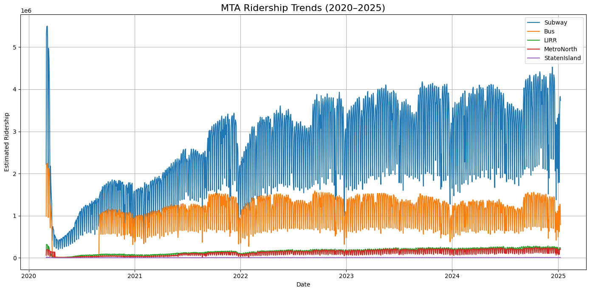
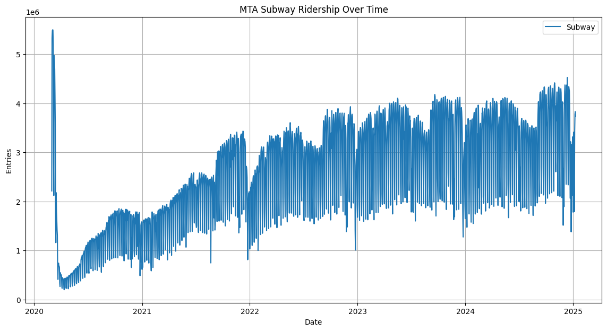
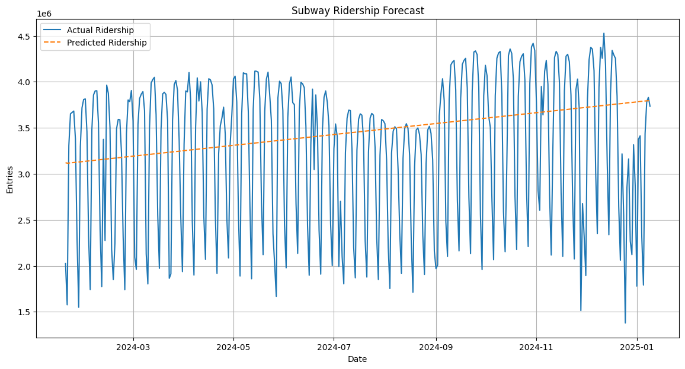
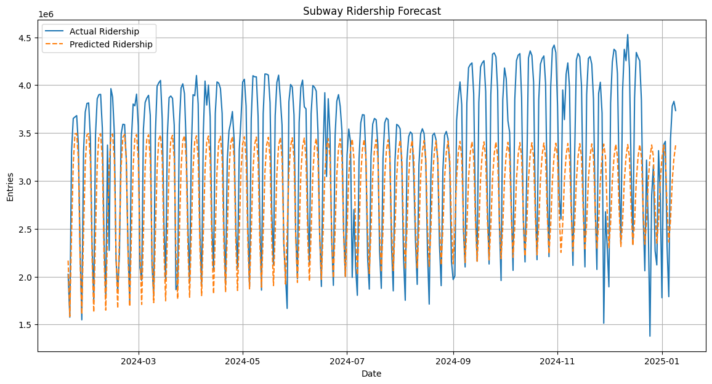
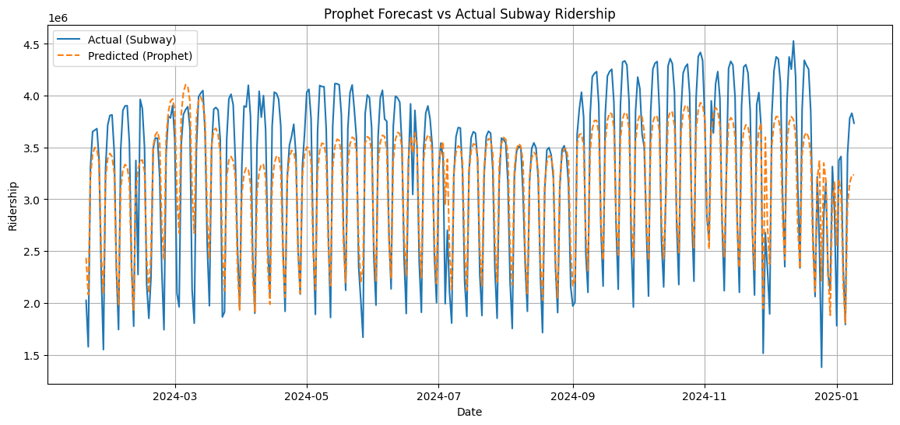

# Forecasting-NYC-Public-Transit-Ridership

## Introduction
For this project, we used the MTA daily ridership from 2020-2025. Using ARIMA or Prophet model, we were be able to predict the ridership on specific days, and also analyze the recovery rate of each transportation mode after COVID-19 lockdown. Then, we predicted the maximum recovery rate over the next 10 years.

## The Dataset
Source: https://catalog.data.gov/dataset/mta-daily-ridership-data-beginning-2020

Timeframe: 2020 - 2025

Columns Used:
- Date
- Subways: Total Estimated Ridership
- Buses: Total Estimated Ridership
- LIRR: Total Estimated Ridership
- Metro-North: Total Estimated Ridership
- Staten Island Railway: Total Estimated Ridership

## MTA Daily Ridership Data: 2020 - 2025


As we can see in the graph, there is a huge drop in ridership around the beginning of 2020. If we follow the trend of each transportation mode, we notice that the ridership gradually increases. The growth are noticable for all mode except Staten Island Railway due to higher volume of riderships of the other tranportations. Nevertheless, we included all modes in our analysis.


## MTA Subway Ridership


The MTA Subway has the largest ridership among all the transporation mode in NYC. Given the large data, we applied both ARIMA and Prophet models. ARIMA served as our initial learning model to forecasting while Prophet offered tools for visualizing trends and seasonality.

### ARIMA
We started with ARIMA because it's a classic baseline model for time series forecasting. This model is design to work for single variable time series data and capture trend and seasonality with differencing.

ARIMA has 3 variables:
1) AR (Auto-Regressive): uses past values as inputs in regression
2) I (Integrated): the data is stationary
3) MA (Moving Average): uses past errors as inputs in regression

Before fitting the model, we prepared subway's data by splitting into training and testing data sets. And then,
we run an ADF test in training data to determine if the data is stationary or not.
```python
from statsmodels.tsa.stattools import adfuller

Run ADF test
result = adfuller(train['Subway'])

print('ADF Statistic:', result[0])
print('p-value:', result[1])
```

The result was:
- ADF Statistic: -2.014709719230118
- p-value: 0.28016087630726183

The p-value is larger than 0.05. This meant the data was not currently stationary. Therefore, we applied differencing again, and we got a result of p-value less than 0.05. Since we differenced twice, our I (Integrated) is equal to 2. This value was used to make the model.
```python
#Make the Model
from statsmodels.tsa.arima.model import ARIMA

model = ARIMA(train, order=(1, 2, 1))  # (p, d, q)
model_fit = model.fit()

print(model_fit.summary())
```
We used the parameters ARIMA(1,2,1) as a baseline model to understand how well a simple ARIMA setup could forecast ridership before tuning or switching models. And, then we forecasted future dates of the training data and compared the prediction to actual rideship in the test data.



We see that the prediction line is linear despite the up and down peaks cause by weekend dips in ridership in the actual data. This suggest that ARIMA(1,2,1) model struggles to fully capture the weekly seasonality. For evaluation, we picked a random date in the testing dataset (June 6, 2024) and predicted the ridership for that day. The result was 3,411,754. However, the actual subway ridership was 1,908,786. There was a huge difference between the two model and was reflected in the MAPE (Mean Absolute Percentage Error), which resulted to 26.57%. As a general rule of thumb, the lower the MAPE is, the more accurate the model. Values under 10% considered highly accurate, 10–20% reasonable, and anything above 20% should be improve.

We decided to try another parameter, ARIMA(7,2,7), to see if it could better capture weekly trends and seasonality, especially the consistent ridership dips during weekends. By increasing the lag terms, we aimed to incorporate the repeating 7-day cycle into the model.



We see that this model capture the peaks and the dips in ridership unlike the first ARIMA model. The predicted ridership on June 6, 2024 is 1,986,790, which is a lot closer to the actual value and the calculated MAPE is 15.78%. These are an improvement compare to the first ARIMA model. However, as we look closer to the graph, we observe that the predicted peaks are remaining relatively flat while the dips are growing deeper each weekend. This suggest that while the model picks up on weekly seasonality, it has issue adapting how much the ridership rises and falls.

To address this, we used a model called Prophet. It is developed by Meta designed to handle seasonality and holidays effects more efficiently. Unlike ARIMA, Prophet requires minimal manual tuning.



Comparing to the previous graphs, this model follows the trend of the actual ridership more precisely, including the steady drop during summer and rebound in the fall. It also captures weekly seasonality better than ARIMA but it still quite underestimate the peaks. 

We also added U.S holidays to see if ridership patterns changed around those dates. We chose random holidays to test the accuracy of each model.

| Holiday (2024)   | ARIMA 727   | Prophet   | Actual Ridership   |
|:-----------------|:------------|:----------|:-------------------|
| Christmas        | 3,241,657   | 2,214,380 | 1,378,374          |
| Independence Day | 3,436,556   | 2,953,830 | 1,992,244          |
| Veteran's day    | 2,549,972   | 3,246,661 | 3,277,617          |

Based on the table above, Prophet's results are closer to the actual ridership during major U.S Holidays. The MAPE result is 9.78%, which is more accurate than the previous models. Therefore, we used this model for the remaining analysis to study how rideship patterns were affected during and after the COVID-19 lockdown period.

### MTA Ridership Recovery Summary

|                              | Subway    | Bus       | LIRR    | Metro-North   | Staten Island   |
|:-----------------------------|:----------|:----------|:--------|:--------------|:----------------|
| Pre-COVID 7-day (Avg)        | 4,574,761 | 1,880,013 | 248,939 | 156,449       | 12,614          |
| Lowest 7-day (Avg)           | 353,271   | 12,814    | 6,672   | 7,667         | 595             |
| Ridership Drop Rate %        | 92.3%     | 99.3%     | 97.3%   | 95.1%         | 95.3%           |
| Latest 7-day Ridership (Avg) | 2,823,710 | 963,512   | 158,824 | 143,322       | 4,517           |
| Latest-Recovery Rate %       | 58.5%     | 50.9%     | 62.8%   | 91.2%         | 32.6%           |
